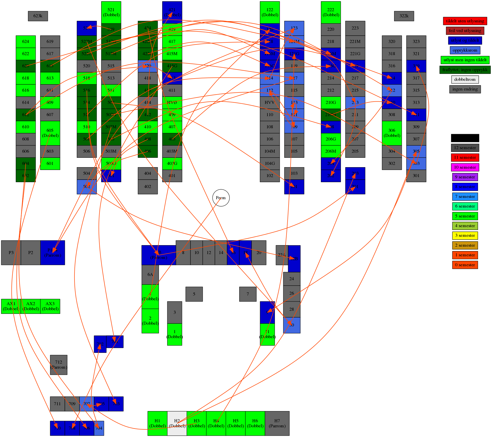

# Visualisering av romfordeling

Opprinnelig laget vår 2014 av Henrik Steen.

## Lag visualisering

Rediger utlyst.txt og bytter.txt og generer bilde med:

```bash
./genpng.sh utlyst.txt bytter.txt
```

Da får man `file.png` som gir en visuell representasjon av romfordelingen.

Rediger genpng.py for romoppsett o.l.

## Eksempel


